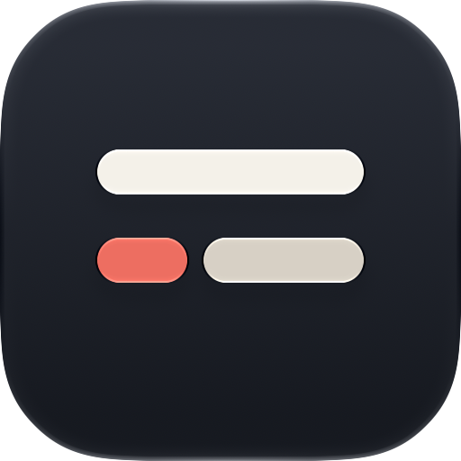
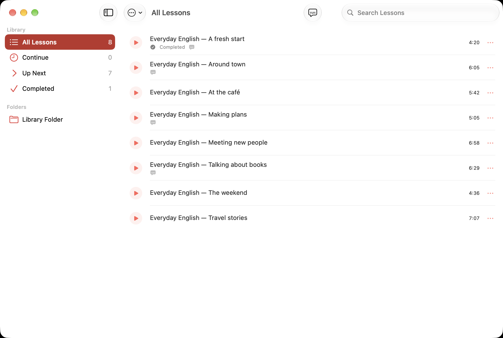

<div align="center">
  <picture>
    <source media="(prefers-color-scheme: dark)" srcset="docs/assets/cuelixa-icon-dark.png">
    
  </picture>
  <h1>Cuelixa</h1>
  <p><strong>Local-first listening practice for Apple silicon Macs.</strong></p>
  <p>Organize local lesson audio, resume where you left off, prepare subtitles on-device, and keep synchronized text in a compact floating player.</p>
  <p><strong>Cuelixa 0.7.3 · Build 56</strong></p>

  [](https://github.com/erhansavas/Cuelixa/actions/workflows/macos.yml)
  [](LICENSE)
</div>

> **Platform status:** Cuelixa 0.7.3 targets macOS 27.0 or later. This release was qualified while macOS 27 and Xcode 27 were in Release Candidate phase, so it is distributed as a GitHub **Pre-release**.

## What Cuelixa does

Cuelixa is a native macOS app for focused listening practice. It keeps the lesson library and listening state local, uses Apple Speech for on-device English transcription, and presents synchronized subtitles with AVFoundation playback without requiring an account or Cuelixa-operated cloud backend.

- Browse and search local lessons, with resume and completion state.
- Use an existing same-basename SRT sidecar or prepare subtitles on-device.
- Queue subtitle preparation while keeping one Speech transcription job active at a time.
- Control playback from the floating subtitle overlay, keyboard shortcuts, or macOS Now Playing controls.
- Import supported audio by drag-and-drop without changing the original source file.

## Screenshots

<p align="center">
  <picture>
    <source media="(prefers-color-scheme: dark)" srcset="docs/screenshots/cuelixa-library.png">
    
  </picture>
  <br>
  <sub>Native library navigation with completion and subtitle status</sub>
</p>

<p align="center">
  
  <br>
  <sub>Prepare subtitles locally or listen without them</sub>
</p>

<p align="center">
  
  <br>
  <sub>Movable subtitle/transport overlay during active playback</sub>
</p>

## Engineering highlights

- Native Swift, SwiftUI and AppKit, with no third-party runtime package dependencies.
- AVFoundation playback validates lesson files and confirms that playback is actually progressing before switching to the floating player.
- Apple Speech transcription runs on-device, supports cancellation, and works from a verified snapshot so durable subtitles stay tied to the expected lesson bytes.
- SQLite persistence uses serialized access, WAL mode, a busy timeout, foreign keys, and transactional library reconciliation.
- Local-file handling uses canonical path checks, explicit symlink boundaries, regular-file checks, bounded reads, verified imports, and atomic publication for app-managed transcripts.
- Managed transcript caches are content-addressed and bind verified SRT bytes to the lesson audio SHA-256.
- Strict Swift concurrency and warnings-as-errors are backed by unit/integration, performance, native UI, smoke, build, Analyze, and source-manifest gates.
- GitHub Actions use immutable action SHAs and narrowly scoped workflow permissions.

See [Architecture](docs/ARCHITECTURE.md) for subsystem ownership, data flows, concurrency, invariants, and the security boundary.

## Requirements

- Apple silicon Mac (`arm64`)
- macOS 27.0 or later
- Full Xcode 27 to build from source

Cuelixa 0.7.3 qualification targets macOS 27 Release Candidate (`26A428`) with Xcode 27 Release Candidate (`27A266a`) and Swift 6.4. Permanent GitHub CI also runs the complete validator on GitHub's available arm64 macOS 27 `xcode-27` image and records the exact hosted OS/Xcode builds. Because hosted images can lag the qualification toolchain, release qualification separately requires the exact candidate to pass on the maintainer's RC environment before it is tagged.

## Install

Release packages are distributed through [GitHub Releases](https://github.com/erhansavas/Cuelixa/releases). For 0.7.3, the release assets are `Cuelixa-0.7.3-macOS-arm64.dmg` and `Cuelixa-0.7.3-macOS-arm64.dmg.sha256`.

1. Open the DMG.
2. Drag **Cuelixa** to **Applications**.
3. Open Cuelixa from Applications.

### First launch

The free GitHub build is ad-hoc signed with Hardened Runtime and is not claimed to be Developer ID signed or notarized. If macOS blocks the first launch, try opening Cuelixa once, then use **System Settings → Privacy & Security → Open Anyway** and confirm **Open**. No Terminal command, SIP change, Gatekeeper disablement, or Recovery-mode change is required.

## Library and local data

New installations use `~/Music/Cuelixa`. A valid existing `~/podcast` library remains supported without destructive migration.

Supported source extensions are `mp3`, `m4a`, `aac`, `flac`, `wav`, `ogg`, and `opus`; actual decoding depends on AVFoundation support in the installed macOS release.

Application-owned data is stored under:

- `~/Library/Application Support/Cuelixa/`
- `~/Library/Application Support/Cuelixa/Transcripts/`
- `~/Library/Caches/Cuelixa/`

Same-basename `.srt` sidecars remain user-owned and usable in place. Cuelixa does not rename source audio.

## Build and test

Open `CuelixaMac.xcodeproj` in full Xcode, select **Cuelixa → My Mac**, and build. The complete qualification command is:

```sh
DEVELOPER_DIR=/Applications/Xcode.app/Contents/Developer \
./VALIDATE-MAC.sh
```

The validator checks source integrity and formatting, application/test compilation, Debug and Release builds, static analysis, deterministic smoke coverage, runtime/integration/performance tests, native UI scenarios, playback behavior, architecture guards, and final bundle metadata. Permanent pull-request CI runs the same validator after confirming an arm64 macOS 27 host with Xcode 27 and Swift 6.4.

See [Build](docs/BUILD.md) and [Qualification](docs/QUALIFICATION.md).

## Privacy and security posture

Cuelixa has no application-managed backend, account, advertising, analytics, or telemetry SDK. Audio, listening progress, and managed subtitles remain on the Mac; Apple Speech may ask macOS to install Apple-managed on-device speech assets.

Cuelixa is an **unsandboxed local application** and does not claim isolation from a malicious process already running as the same macOS user. Its filesystem hardening is defensive correctness around local files and app-owned state, not a claim that Cuelixa is a security product.

See [Privacy](docs/PRIVACY.md), [Security](SECURITY.md), [Architecture](docs/ARCHITECTURE.md), and the [sandbox decision](docs/SANDBOX-DECISION.md).

## Release integrity

For 0.7.3, the release DMG is built from the exact qualified tree on macOS 27 Release Candidate (`26A428`) with Xcode 27 Release Candidate (`27A266a`). The package is ad-hoc signed with Hardened Runtime, remounted for verification, and frozen with SHA-256 before publication.

The GitHub release is published with immutable releases enabled. GitHub's release attestation binds the release tag, commit SHA, and published assets; it is distinct from build provenance for the locally built DMG. A read-only post-publication workflow independently checks the immutable release metadata, exact asset set, source manifest, release notes, checksum, packaged metadata, architecture, and signature.

`SOURCE-SHA256SUMS.txt` detects accidental release-tree drift; because it is stored in the same repository, it is not an independent trust root.

See [Release procedure](docs/RELEASE.md).

## Documentation

- [Architecture](docs/ARCHITECTURE.md) — subsystem ownership, flows, concurrency, invariants, security boundary
- [Build](docs/BUILD.md) — toolchain and validation commands
- [Qualification](docs/QUALIFICATION.md) — what the automated and manual gates establish
- [Release](docs/RELEASE.md) — release preparation, packaging and publication
- [Privacy](docs/PRIVACY.md) and [Security](SECURITY.md) — data handling and vulnerability scope
- [Historical audits](docs/audits/) — preserved engineering evidence, not current architecture

## License

Cuelixa first-party source is licensed under the Apache License 2.0. See [LICENSE](LICENSE), [NOTICE](NOTICE), and [THIRD_PARTY_NOTICES.md](THIRD_PARTY_NOTICES.md).
