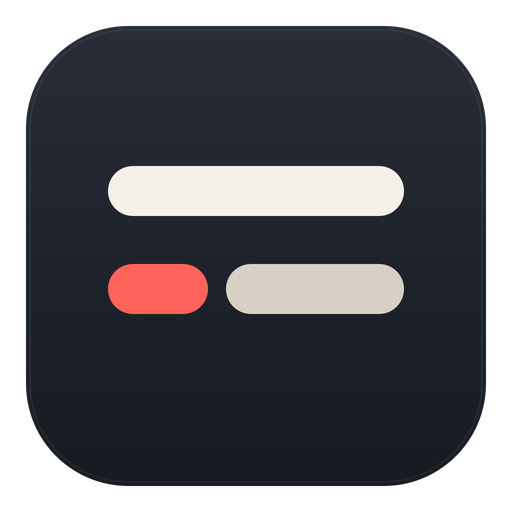

<div align="center">
  
  <h1>Cuelixa</h1>
  <p><strong>Local-first listening practice for Apple silicon Macs.</strong></p>
  <p>Play local lesson audio, resume where you left off, generate synchronized subtitles on-device, and keep those subtitles in a compact floating overlay while you work in other apps.</p>
</div>

## At a glance

- Native macOS application built with SwiftUI, AppKit, AVFoundation, Speech, and MediaPlayer.
- Apple silicon only (`arm64`).
- Requires macOS 26 or later.
- No account, ads, analytics, telemetry, cloud backend, Python runtime, Homebrew package, ffmpeg executable, or bundled third-party framework.
- Audio files remain in your library. Cuelixa stores app state and generated subtitle data locally on the Mac.

## Install

The normal-user package is `Cuelixa-0.6.65-macOS-arm64.dmg` from GitHub Releases.

1. Open the DMG.
2. Drag **Cuelixa** to **Applications**.
3. Open Cuelixa from Applications.

### First launch on macOS

Cuelixa is distributed without a paid Apple Developer ID certificate. macOS therefore cannot identify the developer of downloaded builds, even though the release is built from this repository and is packaged with an ad-hoc code signature so macOS can verify the bundle is internally consistent. This signature does not establish developer identity.

If macOS blocks the first launch:

1. Try to open Cuelixa once.
2. Open **System Settings → Privacy & Security**.
3. Find the message about Cuelixa and choose **Open Anyway**.
4. Confirm **Open**.

This is a one-time approval for that build. No Terminal command, Gatekeeper disablement, `xattr` command, or security-setting downgrade is required or recommended.

A completely warning-free first launch for software downloaded outside the Mac App Store requires Apple Developer ID signing/notarization. This project intentionally does not require a paid Apple Developer Program membership.

## How it works

The library window is used to find, prepare, organize, and start lessons. Once AVFoundation confirms that playback is actually advancing, the library yields to a small movable subtitle/player panel. The panel does not own playback state, so hiding or moving it cannot stop the audio engine.

Cuelixa supports resume/completion state, synchronized subtitles, local subtitle caching, MediaPlayer Now Playing integration, remote commands, filesystem observation, and fixed global shortcuts. `Control-Option-S` shows the library without stopping playback.

## Library and local data

New installations use `~/Music/Cuelixa`. Existing `~/podcast` libraries are preserved in place and remain supported non-destructively.

Supported source extensions are `mp3`, `m4a`, `aac`, `flac`, `wav`, `ogg`, and `opus`; actual decoding depends on AVFoundation support in the installed macOS release.

Application-owned data is stored under:

- `~/Library/Application Support/Cuelixa/`
- `~/Library/Application Support/Cuelixa/Transcripts/`
- `~/Library/Caches/Cuelixa/`

Same-basename `.srt` sidecars remain usable in place. Cuelixa does not rename source audio.

## Build from source

Exact qualification baseline:

- Qualified engineering build: `51`
- macOS 26.6.2
- Xcode 26.6 (17F113)
- Swift 6.3.3
- Apple silicon (`arm64`)

Open `CuelixaMac.xcodeproj`, select **Cuelixa / My Mac**, and build. For the repository qualification sequence:

```sh
./VALIDATE-MAC.sh
```

Engineering qualification identifier: `0.6.65-r51` (marketing version `0.6.65`, build `51`).

See [Build](docs/BUILD.md) and [Validation](VALIDATION.md) for details.

## Privacy and security

Cuelixa is local-first and contains no application-managed network service, analytics, tracking, advertising, updater, helper daemon, Full Disk Access requirement, Accessibility permission requirement, or Input Monitoring requirement.

Apple Speech may ask macOS to obtain Apple-managed on-device speech assets when needed. The application privacy manifest declares no tracking and no collected-data categories.

Security policy and reporting instructions are in [SECURITY.md](SECURITY.md). Privacy details are in [docs/PRIVACY.md](docs/PRIVACY.md).

## Distribution model

The repository has two independent quality gates:

- **Source qualification:** strict Swift concurrency, warnings-as-errors, Debug/Release builds, Analyze, and project-specific smoke tests.
- **Free end-user packaging:** Release build, ad-hoc code signature verification, read-only DMG creation, checksum generation, and GitHub artifact/release publishing.

Free distribution cannot provide Apple notarization. The release workflow therefore never claims that an unsigned/ad-hoc build is notarized or Developer-ID signed.

See [Release](docs/RELEASE.md).

## License

Cuelixa first-party source is licensed under the Apache License 2.0. The `LICENSE` file is the unmodified Apache-2.0 license text; project attribution is in `NOTICE`.

See [LICENSE](LICENSE), [NOTICE](NOTICE), and [THIRD_PARTY_NOTICES.md](THIRD_PARTY_NOTICES.md).
