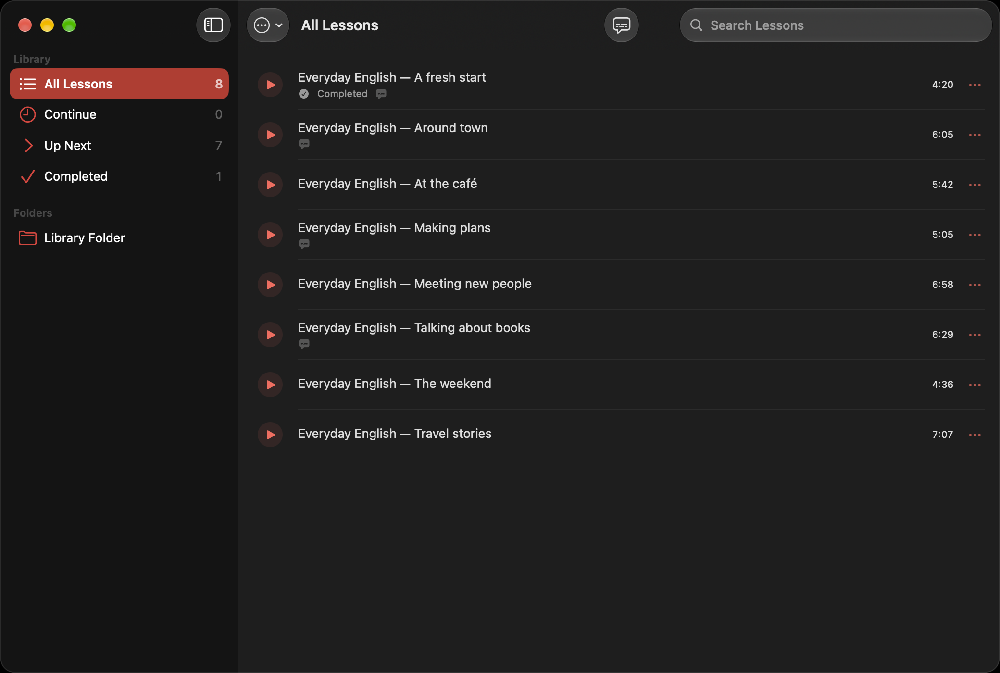
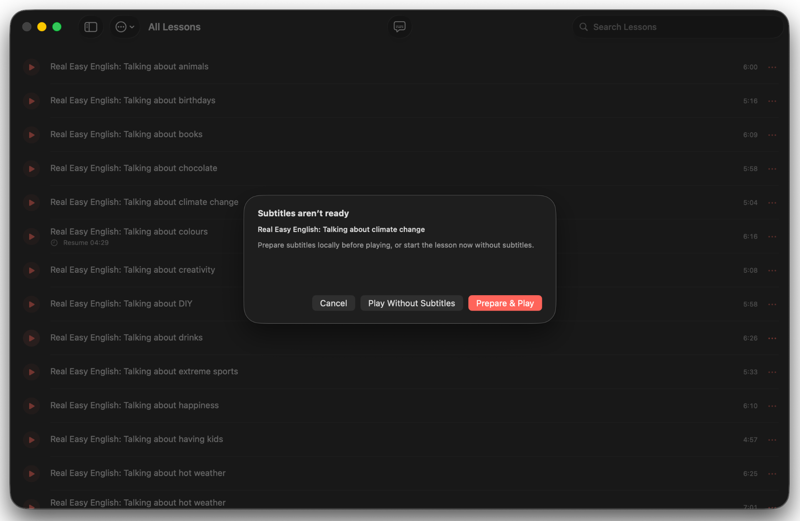
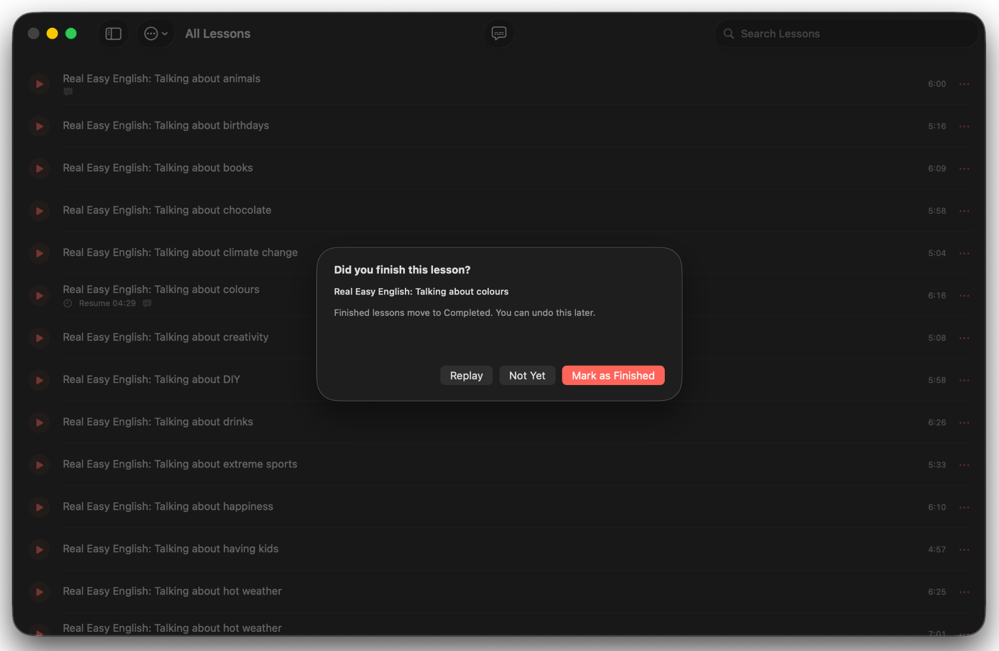

<div align="center">
  
  <h1>Cuelixa</h1>
  <p><strong>Local-first listening practice for Apple silicon Macs.</strong></p>
  <p>Play local lesson audio, resume where you left off, create synchronized subtitles on-device, and keep them visible in a compact floating overlay while you work.</p>
  <p><strong>Current release: Cuelixa 0.6.65</strong></p>
</div>

## Screenshots

<p align="center">
  
</p>

<table>
  <tr>
    <td width="50%"></td>
    <td width="50%"></td>
  </tr>
  <tr>
    <td align="center"><sub>Choose how to start a lesson</sub></td>
    <td align="center"><sub>Create synchronized subtitles locally</sub></td>
  </tr>
  <tr>
    <td colspan="2"></td>
  </tr>
  <tr>
    <td colspan="2" align="center"><sub>Resume, replay, and track completed lessons</sub></td>
  </tr>
</table>

## Highlights

- Native macOS application built with SwiftUI, AppKit, AVFoundation, Speech, and MediaPlayer.
- Designed for Apple silicon (`arm64`) and macOS 26 or later.
- Local-first: no account, advertisements, analytics, telemetry, cloud backend, updater, or bundled third-party runtime.
- Resume and completion tracking, synchronized subtitles, local transcript cache, Now Playing integration, global shortcuts, and filesystem observation.
- On-device subtitle preparation with cancellation and batch processing.

## Install

Download **`Cuelixa-0.6.65-macOS-arm64.dmg`** from the [latest release](https://github.com/erhansavas/Cuelixa/releases/latest).

1. Open the DMG.
2. Drag **Cuelixa** to **Applications**.
3. Open Cuelixa from Applications.

### First launch

Cuelixa uses a free distribution model without a paid Apple Developer ID certificate, so the downloaded build is not notarized by Apple. If macOS blocks the first launch, try to open Cuelixa once, then go to **System Settings → Privacy & Security → Open Anyway** and confirm **Open**.

No Terminal command, Gatekeeper disablement, or SIP change is required or recommended.

## Library and data

New installations use `~/Music/Cuelixa`. Existing `~/podcast` libraries remain supported without destructive migration.

Supported source extensions are `mp3`, `m4a`, `aac`, `flac`, `wav`, `ogg`, and `opus`; actual decoding depends on AVFoundation support in the installed macOS release.

Application-owned data is stored under:

- `~/Library/Application Support/Cuelixa/`
- `~/Library/Application Support/Cuelixa/Transcripts/`
- `~/Library/Caches/Cuelixa/`

Same-basename `.srt` sidecars remain usable in place. Cuelixa does not rename source audio.

## Build and test

The current release uses Xcode 26.6 (`17F113`), Swift 6.3.3, macOS 26, and Apple silicon. Open `CuelixaMac.xcodeproj`, select **Cuelixa / My Mac**, and build.

The full local test sequence is available through:

```sh
./VALIDATE-MAC.sh
```

See [Build](docs/BUILD.md) and [Testing](docs/QUALIFICATION.md).

## Privacy and security

Cuelixa contains no application-managed network service, analytics, tracking, advertising, helper daemon, Full Disk Access requirement, Accessibility permission requirement, or Input Monitoring requirement. Apple Speech may ask macOS to obtain Apple-managed on-device speech assets when needed.

See [Privacy](docs/PRIVACY.md), [Security](SECURITY.md), and the [sandbox decision record](docs/SANDBOX-DECISION.md).

## Release integrity

`SOURCE-SHA256SUMS.txt` covers every tracked release-tree file except the manifest itself. The release workflow verifies the source manifest, builds and tests the application, creates an ad-hoc-signed read-only DMG, verifies the mounted result, and publishes a matching SHA-256 checksum.

Ad-hoc signing is not Developer ID signing or notarization, and the project does not claim otherwise.

See [Release](docs/RELEASE.md) and [Publication](docs/PUBLICATION.md).

## License

Cuelixa first-party source is licensed under the Apache License 2.0. See [LICENSE](LICENSE), [NOTICE](NOTICE), and [THIRD_PARTY_NOTICES.md](THIRD_PARTY_NOTICES.md).
